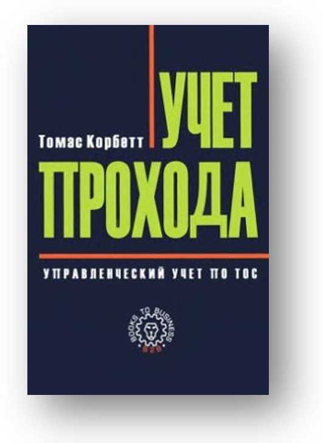
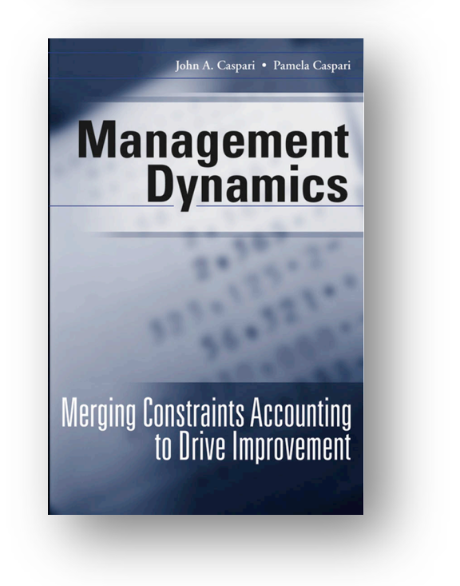

Не забываем и про управленческий финансовый учёт и контроллинг. Его
выполнение --- это задача администрирования. Операционный учёт
материалов, работ и денег (учёт экземпляров тех типов важных объектов,
которые определены менеджерами оргразвития). Речь идёт о модели
предприятия (модель --- это про экземпляры, типы задаются
метаС-моделью). Понятно, что для разных целей разным ролям нужны разные
модели, поэтому есть **ТебеУчёт** и **СебеУчёт**. Вот управленческий
учёт --- это СебеУчёт, а налоговый учёт, иногда демонстрация затрат
клиентам и партнёрам --- это варианты самых разных ТебеУчётов, и очень
часто в этот момент мы вспоминаем **схему** и вполне возможно, что
корректируем управленческие решения, они принимаются по всем учётам в
совокупности. Но чего нельзя делать, так это вместо ведения СебеУчёта
использовать какой-то из вынужденно ведущихся ТебеУчётов.

Как именно надо считать деньги, чтобы принимать решения по управлению
работами --- это задача операционного менеджера. Он управляет и потоком
работ, и потоком денег, ибо нет работы --- нет денег, а если нет денег,
то незачем работать. Максимизируем проход в потоке и работы, и денег.

TameFlow рекомендует Throughput Accounting, построенный на идеях
маржинализма (вы должны были уже понимать эти идеи из материала по
австрийской школе экономики, именно эта экономическая школа совершила
маржинальную революцию в экономике). Вся экономика фирмы базируется на
маржинальных рассуждениях, которые операционным менеджерам надо хорошо
понимать. Так, бессмысленно спрашивать о выгоде проекта, если непонятны
текущие производственные мощности и их текущая загрузка. Сферический
проект в вакууме не может быть оценен как выгодный или невыгодный! А ещё
все рассуждения про «себестоимость» немаржинальны, ими опасно
пользоваться при оценке работы фирмы. Так что управленческий СебеУчёт
должен строиться на принципах маржинализма, и этому хорошо соответствует
как раз Throughput Accounting. Подробности можно узнать в паре книжек.
Первая --- это Томас Корбет, «Учёт прохода. Управленческий учёт по ТОС»
(оригинал вышел в 1998, финансовый учёт --- очень консервативная
практика!):

Вторая книга --- это John and Pamela Caspari, «Management Dynamics:
Merging Constraints Accounting to Drive Improvement», 2004:

Добавить сюда нужно идеи юнит-экономики, но книг по ней нет, ибо
материал важный, но укладывается в размер
статьи^[<https://medium.com/@oliverjwang/summary-a5afeb3d83f3>]:

-   Тоже плод маржинальной революции, отвечает на вопрос «зарабатываем
    ли мы на конкретном потребителе» --- особенно популярен для
    «цифровой экономики» (где один сервер обслуживает тысячи клиентов).
-   Учитывает то, что потребителей не бесконечное количество, и
    стоимость продукции падает с увеличением выпуска, а привлечения
    новых покупателей (юнитов, приносящих прибыль --- их число
    предполагается увеличивать, «масштабирование») --- растёт. Это
    **«маркетинг-озабоченный учёт», важен для привлечения внимания к
    факту зависимости экономики от масштаба выпуска, а масштаба выпуска
    от маркетинга (а не от производства!).**
-   В зарубежной литературе могут по-старинке пользоваться ROI (return
    on investment) или ROMI (return on marketing investment) --- всё то
    же самое, что в юнит-экономике, но относимое к инвестициям в
    конкретную продукцию и конкретный канал дистрибуции (показатели для
    разных продуктов и разных каналов дистрибуции будут разными)
-   Главный показатель --- LTV (lifetime value --- сколько принесёт один
    юнит за всю свою историю) и CA (cost of acquisition --- сколько
    нужно денег на маркетинг, чтобы заполучить юнит).

Огромное количество показателей, в которых легко запутаться (и поэтому
сделать ошибку в принятии решения, а не «уточнить решение»), каждый
автор считает своим долгом придумать ещё какой-то, дать ещё одну (или
даже не одну) формулу. **Не усложняйте учёт!**

Из современных трендов нужно указать также тренд перехода от ежегодного
бюджетирования к ежеквартальному, ежемесячному, а затем (в пределе)
ежедневному --- когда решения о направлениях траты денег принимаются не
заранее за год, а по мере возникновения потребности в деньгах и с учётом
текущих приоритетов, а не приоритетов, которые были, возможно, аж за год
до момента актуального расходования бюджета. Это движение «скользящего
окна финансового планирования» «за пределами бюджета», beyond
budgeting^[<https://bbrt.org/product-category/books/>].
Для этого направления есть уже довольно много литературы, оно скрывается
под разными именами. Там есть довольно много
особенностей^[<https://corporate-rebels.com/beyond-budgeting-model/>]
(большинство из них связаны с тем, что планировать расходы ограниченно,
но можно, но есть большой соблазн планировать и доходы! А вот это
опасно. Помним, что «стратегирование» в менеджменте появилось в 40х
годах прошлого века как раз как «бюджетирование» и только потом стало
независимой практикой, потихоньку избавляясь от ошибок. Но эти старинные
ошибки все вполне могут присутствовать в практиках бюджетирования).
