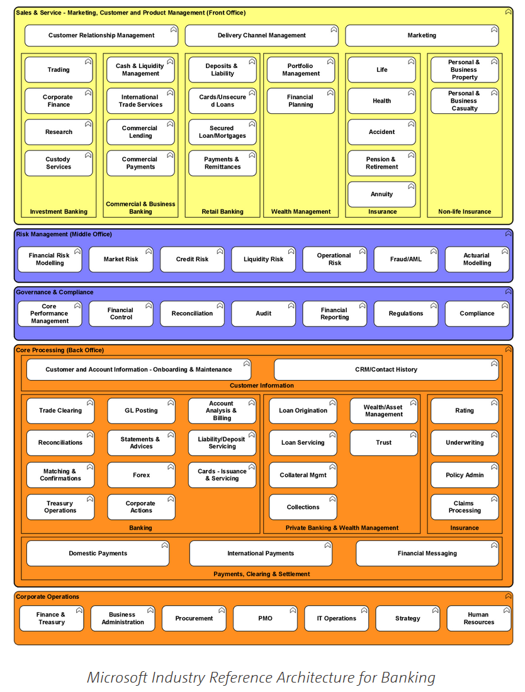
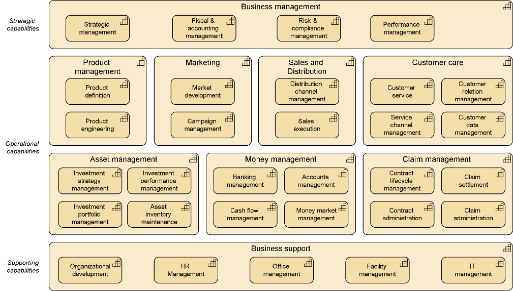

Орг-архитектура также в существенной мере связана с корпоративной
культурой как набором мемов, определяющих организационные нормы. Три
десятка лет назад все идеи **орг-архитектурных стилей (они часто
назывались** **«стиль управления», ибо главный вопрос там ---** **«кто
начальник»)** крутились вокруг идей, считавшихся «естественными» (хотя,
конечно, всё время обсуждались их недостатки и невозможность следования
этим идеям в чистом виде):

-   **Линейная структура управления**, которая выживала лучше всего там,
    где речь шла о каком-то узком ассортименте и массовом производстве.
    Компания разбивалась на части (а там ещё на части, и так «до самого
    низу») по стадиям жизненного цикла, «этапам» (жизненный цикл
    1.0) --- и там осуществлялась попытка реализовать «водопад» или
    «конвейер». Во главе стоял начальник (мы говорим о полномочиях) как
    условный «менеджер проекта/продукта»::роль, чья задача была ---
    выпустить работающий продукт (в голове у него --- целевая система).
    Специалисты по самым разным практикам подчинялись этому «менеджеру
    проекта» (операционному менеджеру) по иерархии управления. И всё
    отлично работало, пока продукт был один. Проблемы были, когда
    продуктов оказалось несколько.
-   **Функциональная структура** **управления**, в которой учитывалось,
    что продуктов выпускается много, жизненные циклы у них разные, а
    функционально все работы делаются специалистами по каким-то
    практикам. Это соответствовало пониманию жизненного цикла 2.0. Эти
    специалисты по разным практикам и стали главными, ибо менеджеров
    проектов было много, и они торговались за то, чтобы какой-нибудь
    Олег выполнил свою уникальную работу на ограниченном ресурсе этого
    Олега в его проекте, а не на проекте другого менеджера. Эта
    структура оказалась более живучей (в голове у функциональных
    менеджеров была система создания), но и там были проблемы: вечный
    скандал за ресурсы. А ещё в дело вмешивались администраторы, которые
    непосредственно в работе не участвовали, но могли запросто перекрыть
    кислород любому подразделению, если им что-то не нравилось. В ходу
    был мем про «леди-хранительницу печати», которая была без полномочий
    и просто ставила печать на бумаги, подписанные боссом. Но когда она
    невзлюбила какое-то подразделение, то по самым разным очень
    творчески придумываемым причинам печать на документах этого
    подразделения не ставилась --- то она была всегда «на обеде, вышла»
    для этого подразделения, то печать ставилась смазанной, то случайно
    рвался сам документ, и так всегда. Смысл мема в том, что в
    функциональной структуре была вечная склока борьбы за ресурсы ---
    ибо операционных менеджеров было много.
-   **Матричная структура управления** просто заявила, что она
    одновременно и линейная, и функциональная. А отдельные люди и
    отдельные команды подчиняются одновременно и функциональным
    менеджерам, и менеджерам проектов, причём в случае конфликтов
    требований они обращаются к своим менеджерам, а те к своим
    менеджерам, и так до самого верха иерархии, где всё сходилось на
    генеральном директоре. Формально это было неработоспособно, но по
    факту работало относительно хорошо: люди уторговывали свои ресурсы в
    неформальной схеме работы, которая никак не совпадала с формальной
    структурой полномочий. Поэтому неформально люди понимали, кто в
    каждой ситуации может давать указания о распределении ресурсов
    (проектный начальник какого-то уровня или функциональный начальник
    какого-то оргзвена, связанного с практиками).
-   **Кроссфункциональные команды** стали ответом на вопрос о том, что
    делать отдельным специалистам в матричной структуре. Люди формально
    оставались работниками в штатном расписании функциональной структуры
    (подразделение), но их переводили особыми приказами во временное
    подчинение проектным менеджерам в команды проектов, набирая команду
    спецов по всем необходимым практикам (кросс-функционально, «через
    все практики»). Команда проекта подчинялась начальнику проекта, но
    люди «числились» за функциональными подразделениями. То есть это по
    факту было восстановление линейной структуры управления при наличии
    одновременно и функциональной структуры --- но жизнь была уже
    полегче, ибо функциональная структура не менялась, а вот
    кроссфункциональные команды менялись. Уже не лихорадило с выплатой
    зарплаты, уходом в отпуск, обеспечением рабочего места и прочим
    администрированием, ибо работник вроде как постоянно работал на
    одном рабочем месте, но по факту его оргзвеном была
    кроссфункциональная команда --- и как только она становилась большой
    и таких команд становилось много, это наследовало все проблемы
    линейной организации, функциональной организации и матричной
    организации с её «неформальными коммуникациями».
-   **Горизонтальная структура управления** была попыткой отразить тот
    факт, что люди как-то общаются и утрясают свои дела в неформальной
    структуре, не совпадающей с границами команд. Рассуждения эти
    питались двумя идеями: 1. Раз уж ни линейная/проектно-продуктная, ни
    функциональная по практикам работы иерархии не работают, а матричная
    структура и кроссфункциональные команды не могут решить этих
    противоречий, то откажемся от них вообще. Как-нибудь разберёмся
    неформально, позволим общаться людям всем со всеми, сотрудничать во
    всём. 2. Утопические социалистические идеи коммунального
    существования (фирма-колхоз, коллективное хозяйство, «у нас тут
    дружная семья, все занимаются всем, нет должностей/оргмест,
    свободная работа свободных людей над тем, что им нравится»). Такой
    «коммунизм», конечно, в природе существует, но обычно где-то там
    находится какой-то источник сверхприбыли, который обслуживается
    очень узкой неформальной группой хорошо организованных (то есть все
    там понимают, кто чем занят, у кого какие роли, кто что кому делает
    и как быстро) людей, а остальные изображают «семью» вместо рабочего
    коллектива, при этом нравы в этой семье часто нездоровые. Этот тренд
    ухода от иерархии в оргструктуре имеет множество названий. Например,
    пять-восемь лет назад была очень модна холакратия, но лидеры этого
    подхода успели отказаться от неё в пользу других
    оргструктур^[<https://enliveningedge.org/organizations/zapposs-evolution-holacracy-market-based-dynamics/>].
    Сторонники спиральной
    динамики^[<https://en.wikipedia.org/wiki/Spiral_Dynamics>]
    напирают на жёсткую последовательность так называемых «уровней
    развития», при этом подход общих для всех ступенек развития
    опровергнут, но до сих пор любят говорить о «бирюзовых/teal
    организациях», которые тоже игнорируют идею авторитарного подчинения
    воле руководителя-вождя или даже идею жёсткого следования
    организационным
    нормам^[<https://ailev.livejournal.com/693597.html>],
    что тоже было в острой моде пять-восемь лет назад, и тоже сегодня
    уже не модно (но помним про растянутость пелотона: люди, которые
    узнали об этой идее десяток лет назад, до сих пор продолжают
    говорить о «бирюзовых организациях» как о менеджерском фронтире).

Таких «кулибинских» инициатив отхода от строго иерархической
оргструктуры было множество. Все они игнорируют достижения инженерной
архитектуры, связанные с изучением влияния разных способов организации
модулей на архитектурные характеристики. В какой-то мере это
«организационная алхимия», вера в успех корпоративной культуры,
основанной только на каких-то общих идеях (мемах) «сотрудничества,
взаимопонимания, равенства» и прочих коммунальных
(социалистически-утопических, вспоминаем курс австрийской школы
экономики) идеях «свободы, равенства, братства». Инженерия же говорит,
что есть разные архитектурные стили (монолит, микроядра,
сервис-ориентированная архитектура, микросервисы и т.д.), так что всё то
же самое должно быть и в организации --- особенно если учесть обратный
манёвр Конвея, требующий уподобить структуру коммуникации между
модулями-оргзвеньями в оргсистеме создателя структуре коммуникации между
модулями в целевой системе.

В итоге исторически победила формальная функциональная структура, в
которой вроде бы считается, что подразделения (не оргзвенья!
«подразделения согласно иерархическому штатному расписанию, со
структурой подчинения строго по иерархии») организованы 1:1 в
соответствии с функциональной декомпозицией (одна практика работы,
выполняемая одной организационной ролью, соответствует одному
подразделению). Поэтому функциональная декомпозиция по оргролям вроде
как была достаточна для понимания концепции организации --- а сам такой
принцип был как раз архитектурным: «делим всё на оргроли, создаём
подразделения, а уж как они общаются --- это уж как получится, но при
надобности создадим кросс-функциональные команды, в наших архитектурных
диаграммах они отражаться не будут». После этого стали популярными
изображения типовых функциональный декомпозиций, которые получили
название **справочных/reference** **архитектур.** Эти типовые
функциональные декомпозиции разрабатывались поставщиками корпоративного
софта, которым было удобно по подобным диаграммам объяснять, какие
функции поддерживает этот софт. Ещё такие функциональные декомпозиции
были удобны оргпроектировщикам (называвшим себя архитекторами
предприятия), которые брали их за начальную точку в своей работе по
оргпроектированию верхнего уровня.

Вот пример справочной архитектуры для банковской
деятельности^[<http://blog.bizzdesign.com/reference-architecture-models-with-archimate>],
и обратите внимание на невозможность обсуждения архитектуры ---
непонятны взаимодействия между отдельными функциями, это не
функциональная диаграмма/принципиальная схема предприятия, а именно что
декомпозиция функций. То есть вроде как в названии слово «архитектура»
есть, а ничего про интерфейсы и взаимодействие модулей мы сказать не
можем, обсудить связность/coupling не можем:

Эта справочная архитектура по старой традиции показана в диаграммном
языке архитектуры предприятия
ArchiMate^[<https://pubs.opengroup.org/architecture/archimate32-doc/>
(версия 3.2, опубликована в октябре 2022)], и в ней
выбраны значки практик::поведение «шеврончики вверх», а названия даны
вообще для оргролей::функциональных объектов.

Справочная архитектура предприятия ArchiSurance из примера использования
языка ArchiMate выглядит
так^[<https://bizzdesign.com/blog/archimate-3-0-capability-mapping/>]:

Тут центральное понятие оргвозможности/capabilitities: те же практики,
только уже воплощённые, причём у каких-то оргзвеньев есть ресурсы и
полномочия для выполнения сервисов согласно этим практикам. Но точно так
же нет оргзвеньев и интерфейсов, показывающих их взаимодействие,
оргзвенья тут подразумеваются, а не описываются.

Даже диаграммная форма тут лишняя: показана просто функциональная
декомпозиция предприятия (отношения часть-целое показаны вложением
графических элементов, но могли бы быть показаны стрелочкой с ромбиком
на конце, как это рассказывалось в курсе «Системное мышление»). Эти
справочные архитектуры вполне могут быть отражены в аутлайне/outlines
(иерархическое оглавление, вложенные списки).

Эти типовые/справочные разбиения практик чисто исторически называются
«архитектурами». Архитектура занимается не столько функциональными
описаниями в концепции системы, сколько накладывает ограничения на
конструктивное описание. Орг-архитектура сегодня --- это:

-   принципы разбиения предприятия на модули (часто и само
    верхнеуровневое разбиение), то есть на оргзвенья (не только
    подразделения, но и структуры вне штатного расписания --- комиссии,
    кросс-функциональные программы, интегральные команды введения в
    эксплуатацию/integrated delivery teams, «производственные
    кооперации» из организованных согласно договору подрядчиков вне
    границ текущего юридического лица и т.д.).
-   принципы организации взаимодействия этих модулей между собой
    (интерфейсы, возможность непосредственного взаимодействия
    оргзвеньев/«видимость модулей», средства коммуникации, способы
    организации совместной работы).

Мы намеренно не упоминаем в нашем курсе многочисленную литературу по
классической архитектуре предприятия, рассказывающие о старинных идеях.
Мы **намеренно не даём ссылки** **(то есть не рекомендуем к
использованию!)** на

-   литературу по ArchiMate (хотя и привели ссылку на спецификацию
    стандарта, чтобы можно было узнать подробней, что же именно
    указывалось на диаграммах справочных архитектур),
-   стандарты IDEFx (из многочисленных этих стандартов берут главным
    образом стандарт функциональной декомпозиции IDEF0, но читают его
    как декомпозицию стадий работ --- другой стандарт IDEF3, но это
    опять оказывается не про архитектуру), моделях Захмана (там общие
    слова, что «оргпроекты нужно моделировать»),
-   стандарт TOGAF, который очень нравится госчиновникам и бюрократам в
    крупных организациях --- если вам не нужно много общаться с
    архитекторами организаций, воспитанными на идеях прошлых поколений
    орг-архитектурной мысли, вам этого не нужно. А если вам нужно с ними
    много общаться, то вы и сами со всем этим разберётесь, всю
    литературу найдёте сами.

Ещё нужно отличать архитектуру предприятия в её старом понимании как
концепции предприятия (оргпроект) и так называемую бизнес-архитектуру,
которая по факту занимается набором стратегических моделей. Раньше это
всё относилось к «архитектуре предприятия», но потом «модель прозрачного
ящика» (оргмодель, занимаются оргпроектировщик и орг-архитектор, хотя
там много работы и других ролей) отделилась от «модели чёрного/серого
ящика» (стратегия, упор на бизнес-модель, главный там бизнесмен --- но
это коллективная работа). Вот ключевые слова, чтобы вам сразу было
понятно, что это вообще не про архитектуры разговор:

-   Оргпроект (концепция предприятия и в целом модели деятельности
    предприятия, раньше «архитектура предприятия»): практики,
    проекты-процессы-контрольные точки, оргроли и оргзвенья (структура
    оргзвеньев и их связь: современная орг-архитектура тут),
    IT-поддержка управления работами.
-   Стратегия (раньше «бизнес-архитектура»): бизнес-модель, мотивация
    (полезность, цели), справимся ли мы (capabilities, resources), с
    какими партнёрами и на каких рынках. А где «архитектура»? Тут,
    скорее, прописываются архитектурные решения по структурированию
    рыночной ниши, которую хочет занять предприятие, реверс-инжиниринг
    архитектурных решений, которые можно предположить (а иногда при
    формировании новых рынков и навязать) для надсистем целевой системы
    предприятия прежде всего, а также для надсистемы предприятия как
    инвестиционной среды. Ну, и слово «архитектура» тут исторически, от
    древнего понимания «архитектуры предприятия».

Бизнес-архитекторы, тем не менее, имеют уже свои профессиональные
стандарты и корпуса знаний
(BABoK^[<https://www.iiba.org/career-resources/a-business-analysis-professionals-foundation-for-success/babok/>] ---
business analysis body of knowledge, и обратите внимание на ещё один
сдвиг в терминологии: уже не бизнес-архитектура, а бизнес-анализ, акцент
не на архитектурном синтезе, а на декомпозиции, анализе), свою
ассоциацию^[<https://www.iiba.org/>] ---
и если речь идёт о стратегировании и роли бизнесмена, то вам может быть
интересно поработать с этими материалами, только не обращайте внимания
на слово «архитектура», когда будете читать тексты этих «аналитиков»
(тамошние описания имеют далёкое отношение к принципам разбиения чего бы
то ни было на оргзвенья и налаживания интерфейсов между этими
оргзвеньями).
