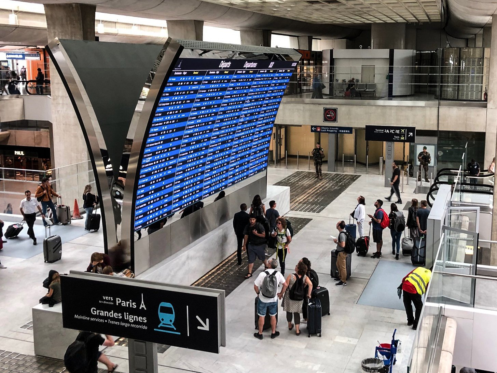

Следующее, что надо делать, чтобы облегчить работу по новой практике ---
это дать людям средства организоваться в части стыка разных практик
между собой. Для этого практики должны стать видимыми. Вспомним материал
курсов «Моделирование и собранность» и «Системное мышление»: невидимое
делает видимым моделирование, а важное в видимом подчёркивает системное
моделирование. **Значительная часть деятельности в компании должна
координироваться не методами выдачи поручений, а путём** **создания и**
**табло, отображающего какие-то фрагменты системную модель
организации.**

Представьте аэропорт, в котором идёт транзит десятка тысяч пассажиров в
сутки, а также сотен самолётов. Каким-то чудесным образом каждый
пассажир сам находит маршрут в этом лабиринте к стойке сдачи багажа, а
затем к нужному гейту, за которым его ожидает самолёт. Нет никакой
системы, которая выдавала бы пассажиру команды, куда ему идти (хотя
такие команды мы иногда слышим: «пассажир Имярек, пройдите на посадку в
гейт такой-то», но это исключение, управление всеми посадками устроено
по-другому, нет выдачи индивидуальных команд). Чтобы люди как-то
«самоорганизовались» (помним про «подстройку, как в джазовом ансамбле»),
важные части модели аэропорта документированы и вывешены на всеобщее
обозрение. Все гейты имеют свои номера, в аэропорту стоят указатели,
куда надо идти, чтобы найти эти гейты. Но какие именно гейты работают на
посадку на какие рейсы, что происходит с рейсом --- это каждый пассажир
узнаёт сам на **табло**/dashboard, где отображается текущая ситуация с
учётом всех изменений. Сейчас это табло выносится на экран смартфона
каждому пассажиру, текущая ситуация понятна со всеми изменениями не
только после прибытия в аэропорт, но ещё по пути в аэропорт, или даже
раньше. После получения информации на табло пассажир предпринимает все
нужные действия сам: торопится, или не торопится, ищет администраторов
аэропорта в случае затруднений, находит путь к гейту, ориентируясь на
указания, в случае задержек рейса меняет решение о поездке или терпеливо
ждёт, но главное --- он не требует внимания менеджеров, не требует
внимания других пассажиров.

Этот же принцип «табло», перенесённый на всё то, что происходит в
компаниях, называют визуальный менеджмент/visual
management^[<https://www.lean.org/the-lean-post/articles/visual-management-the-good-the-bad-and-the-ugly/>].
Это не надо путать с «визуальным мышлением» или диаграммным
моделированием! Тут имеется ввиду только то, что какая-то модель
происходящего оперативно доступна для того, чтобы участники работ могли
разобраться в происходящем и скоординировать по ней свои собственные
действия. До широкого распространения компьютеров для этого
использовались буквально стены, которые обвешивались графиками и
диаграммами. Впрочем, «настенные табло» до сих пор в ходу. Вот примеры
табло, называемого «канбан-доска»:

Сейчас такое моделирование всё менее и менее популярно, табло/dashboards
ушли в компьютеры, и даже дальше --- в смартфоны, они доступны отовсюду,
не нужно вставать с места и подходить к табло, чтобы оценить ситуацию.
Но менеджменту с самыми разными инженерами надо тщательно готовить эти
табло и их использование для организации труда в больших коллективах
(это не всегда так очевидно, как использование табло для нахождения
места регистрации багажа и гейта выхода к самолёту в аэропортах). Если
не иметь табло, вам придётся переходить к координации путём выдачи
указаний, это сразу создаёт проблему дополнительного человека, который
будет выдавать указания многим людям и немедленно станет ограничением
потока --- но и тут будет проблема, ибо принимать решение «что кто с чем
когда будет делать» такому человеку-руководителю (буквально, от «водить
чужими руками») всё равно придётся, и ему нужно будет ровно то же табло,
по которому разумные люди и сами могли бы принять решение о том, что и
когда им нужно делать. Поэтому по возможности переходите на визуальный
менеджмент, старайтесь, чтобы работу выдавали не одни люди другим, а
люди её брали сами, ориентируясь на тщательно спроектированные табло ---
всевозможные компьютерные dashboard.

Так, озаботьтесь тем, чтобы решения по архитектуре организации были
доступны всем, иначе вы замучаетесь отслеживать их нарушения.
Озаботьтесь тем, чтобы все чеклисты были доступны, чтобы были доступны
результаты прохождения этих чеклистов --- и не надо будет интересоваться
каждые пять минут, что там происходит у соседей или подчинённых.

Табло поднимают предсказуемость того, что происходит в окружении каждого
работающего, снимают неопределённость в происходящем --- а это крайне
важно.
